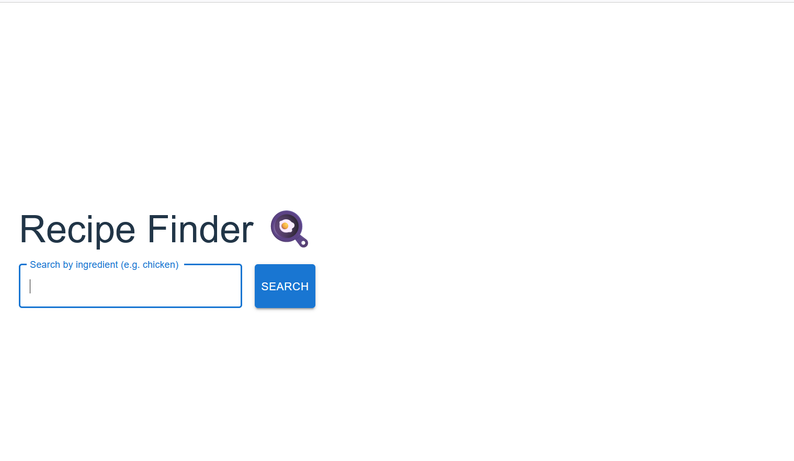
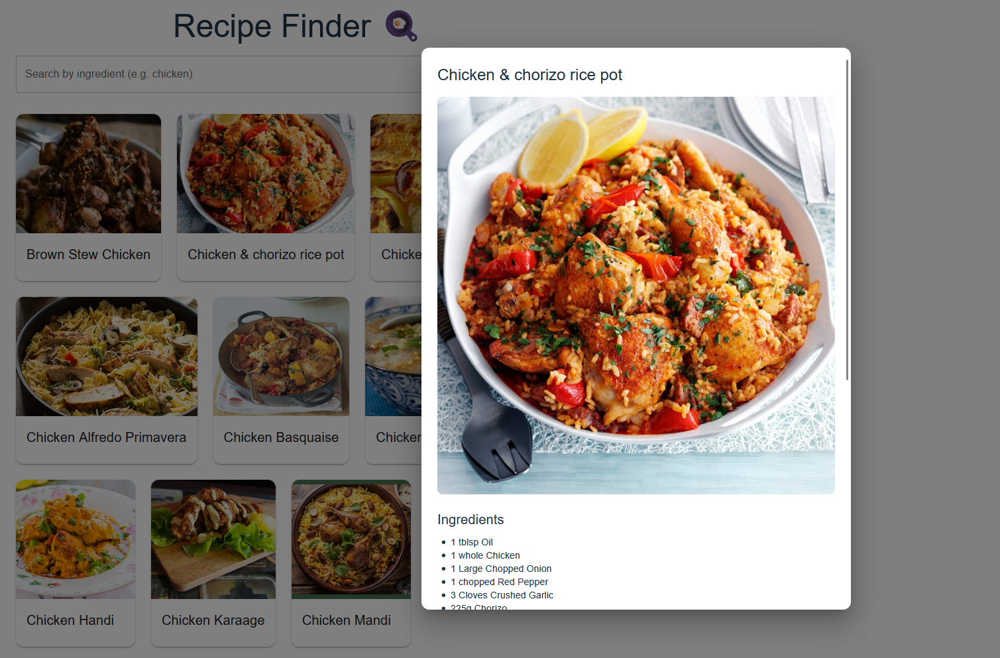

# 🍳 Recipe Finder App

A modern React application that allows users to search for recipes based on ingredients, view details, and explore cooking instructions.

## 🚀 Live Demo
https://recipe-finder-polished-pmtf2qs9b-django-react-arts-projects.vercel.app/

## ✨ Features
- 🔍 Search recipes by ingredient
- 📦 Fetch real-time data from API
- 🖼️ Interactive recipe cards with hover effects
- 📖 Detailed modal with ingredients & instructions
- ⏳ Loading spinner for better UX
- ❌ Handles empty search results gracefully

## 🛠️ Tech Stack
- React (Vite)
- Material UI
- JavaScript (ES6+)
- REST API (TheMealDB)

## 📸 Screenshots



## 📚 What I Learned
- Working with APIs and async/await
- Managing state in React
- Component-based architecture
- UI/UX improvements with Material UI
- Handling loading and empty states

## 📦 Installation

```bash
git clone https://github.com/django-react-art/recipe-finder-app.git
cd recipe-finder-app
npm install
npm run dev